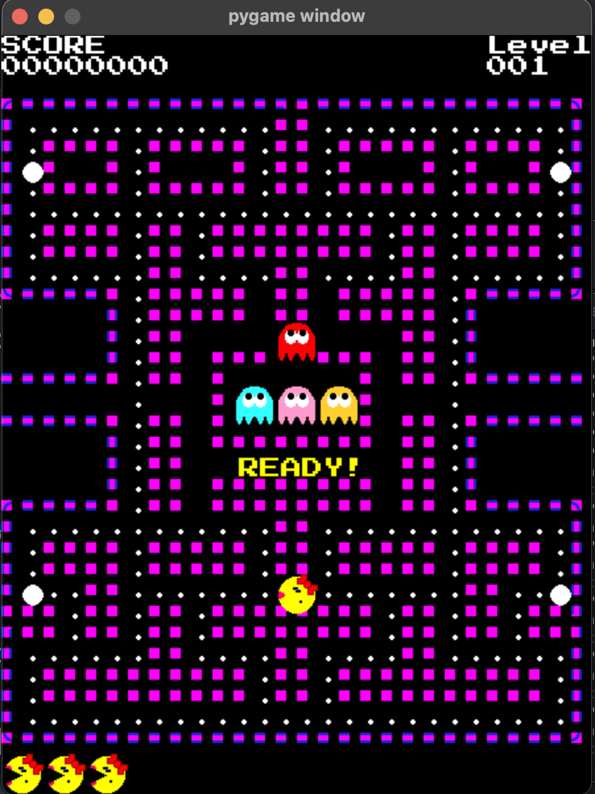

# Process and Credits
Before I begin to explain anything, I want to give a huge shoutout to this website:

https://pacmancode.com/

The creator provides an amazing step-by-step guide on how to create a version of Pacman like the one I built. Honestly, most of the credit for this project should really go to whoever made this, because I followed their incredible steps, from start to end. 

This project took about a month to finish. It really exposed me to object-oriented programming in python. I had previous oop experience in java and c++, but it was nice to see how it works in python. People kept telling me that object oop in python is weird, but I honestly really enjoyed how it's set up. I used the pygame game library with python. It works super well and really has some amazing and easy functions. I'm really happy I decided to take on this little project, it really gives some amazing insight into the world of game development, and man ... that is something I would never want to do.

# Controls
The controls for this program are just like you would expect. Use the arrow keys for Up, down, left, and right. Press the space button to pause the game. The game will always be initially paused when you boot it up, so just make sure to press the space button (the same goes for when Pacman dies).

# Installation & Running
If you want to download and play this Pacman game there are a few prerequisites. First, and most importantly you need to make sure you have python installed.
Second, you need to make sure you have the pygame library installed. It should just be:

```
pip install pygame
```

If that doesn't work here is their webstie for more
info:

https://www.pygame.org/wiki/GettingStarted#Pygame%20Installation

Lastly, it should already be installed when you download python, but make sure Numpy is installed
You can use the command:

```
pip install numpy
```


Once Everything is intalled, open the gameFiles directory on your command line, and type:

```
python3 run.py
```
If everything is working correclty you should see a window open up on your screen!


